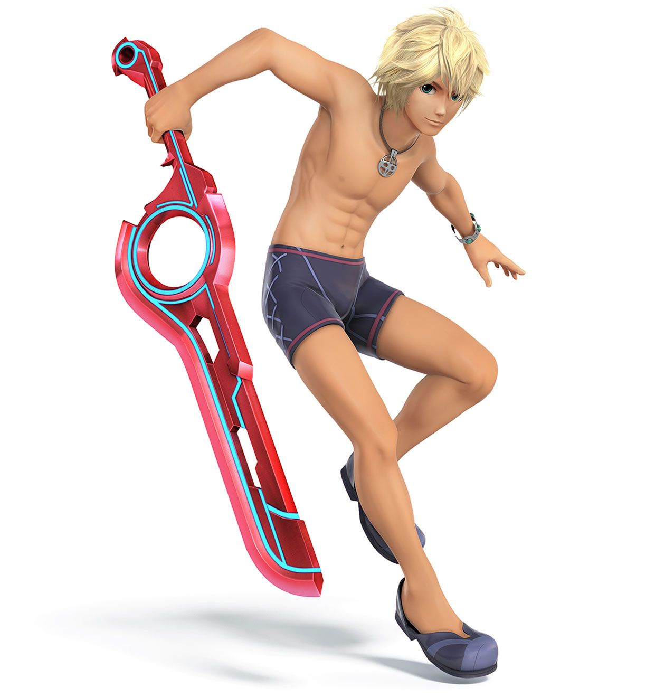
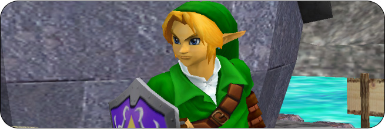
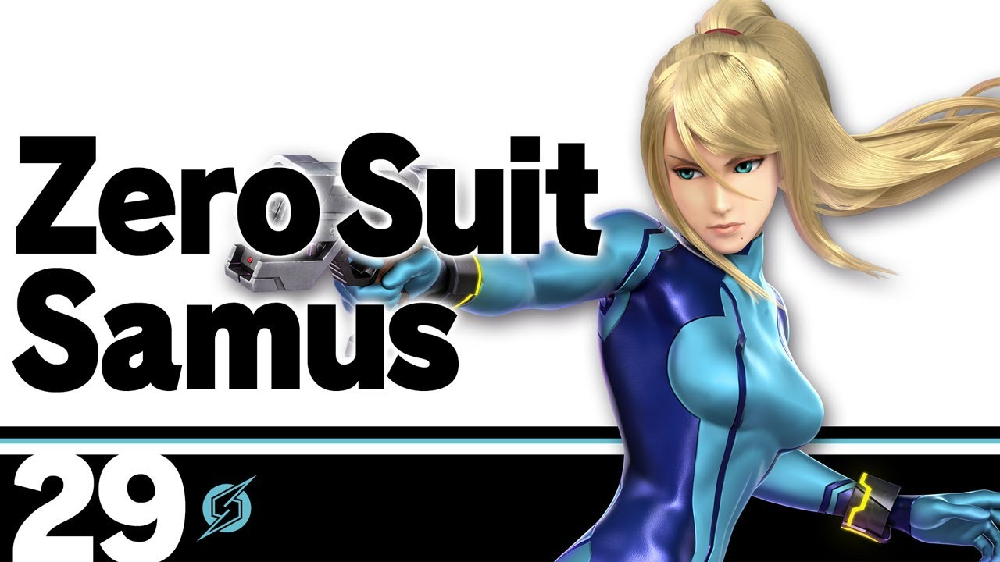

# Hannah and Evan's Super Smash Bros. Team
<!DOCTYPE html>
<html>
<head>
  <title>Hannah and Evan's Smash Bros. Team!</title>
</head>
<body>

<h1> Hannah's Bio </h1>

 Ciao! My name is Hannah. I'm 22. I recently graduated from Western University, with a degree in Foriegn Language and Culture Studies, and University of Toronto with a certificate in TEFL. I decided to take this course last minute, and it is very different to my usual area of study. Therefore, it is all quite new to me! Some of my hobbies include photography, watching old cinema, language learning, and of course, playing Super Smash Bros. I was actually first introduced to html and css when I was 13, and I was using it on Tumblr! Throwback.  

<h1>Hannah's Mains</h1>
<h2>Shulk from Xenoblade Chronicles.</h2>

Shulk can swicth his 'arts' to advance either his jump, speed, shield, buster, or smash. Shulk has a counter attack. Shulk has 7 colour swatches and one 'swimming trunks' outfit. He has several moves including Monado Arts, Back Slash, Air Slash, Vision, Chain Attack, and various specials. 

<h3>Link - Melee</h3>

Link has various moves. He has ground attacks, aerial attacks, grabs, throws, and specialty moves. Some of the specialty moves are bow, boomerang, and spin attacks. The voice used in Melee was voice effects in Ocarina of Time. Link has several outfits, each changing colour. 

<h4>Zero Suit Samus</h4>

Zero Suit has a few special moves including paralyzer, plasma whip (my favourite), boost kick, flip jump, and final smash. Her enterance is her jumping out of her Gunship and using her Jet Boots to land beofre the battle starts. 

<iframe width="420" height="315"
src=https://www.youtube.com/watch?v=nA5qRHIl0qY&ab_channel=JasonatorDM3>
</iframe>

</body>
</html>